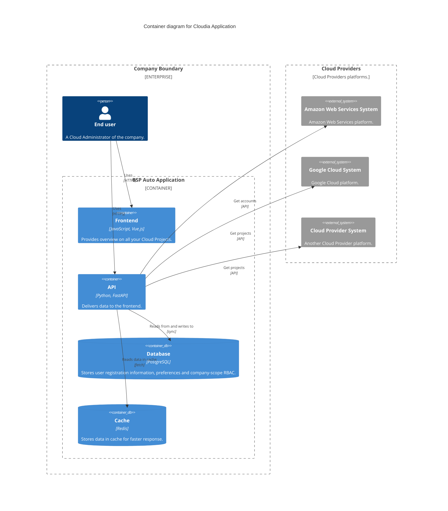

# Core components

## Components

| Component | Technology | URL |
| --- | --- | --- |
| Frontend | [Vue.js](https://vuejs.org/) | [germainlefebvre4/cloudia-front](https://github.com/germainlefebvre4/cloudia-front) |
| API | [FastAPI](https://fastapi.tiangolo.com/) | [germainlefebvre4/cloudia-api](https://github.com/germainlefebvre4/cloudia-api) |
| Database | [PostgreSQL](https://www.postgresql.org/) |  |
| Cache | [Redis](https://redis.io/) |  |

### Frontend

The frontend is a Vue.js application that provides an user interface to the Cloudia application.

### API

The API is a FastAPI application that handles data of the Cloudia application.

The API is a REST API that provides data to the frontend. It is a interface between Cloud Frontend and Cloud Providers APIs allowing to homogeneous retrieved data.

### Database

The database is a PostgreSQL database that stores user registration information, preferences and company-scope RBAC.

PostgreSQL database is used to store user database and settings.

### Cache

The cache is a Redis database that stores data in cache for faster response.

Redis cache is used to store data on mid/long term. Retention depends on the data.

| Scope | Key definition | Retention time |
| --- | --- | --- |
| Projects | `cloud:{provider}:projects` | 7 days |
| Projects Tags | `cloud:{provider}:projects:tags` | 7 days |
| Billing by month | `cloud:{provider}:project:{project_id}:billing:{date_month}` | 7 days |
| Billing for current month | `cloud:{provider}:project:{project_id}:billing:current` | 1 day |

## Relations

