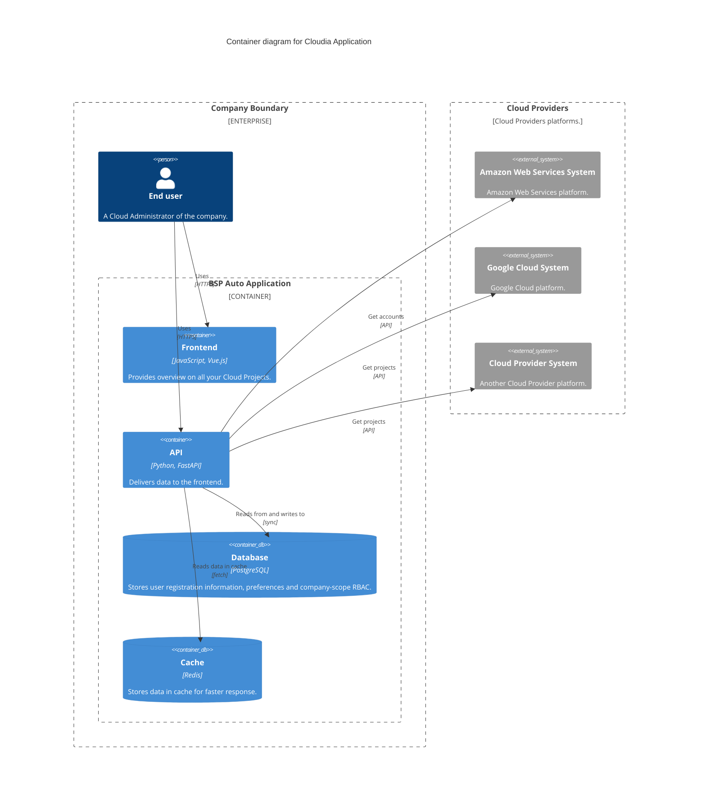

# Core components

## Components

| Component | Technology | URL |
| --- | --- | --- |
| Frontend | [Vue.js](https://vuejs.org/) | [germainlefebvre4/cloudia-front](https://github.com/germainlefebvre4/cloudia-front) |
| API | [FastAPI](https://fastapi.tiangolo.com/) | [germainlefebvre4/cloudia-api](https://github.com/germainlefebvre4/cloudia-api) |
| Database | [PostgreSQL](https://www.postgresql.org/) |  |
| Cache | [Redis](https://redis.io/) |  |

### Frontend

The frontend is a Vue.js application that provides an user interface to the Cloudia application.

### API

The API is a FastAPI application that handles data of the Cloudia application.

### Database

The database is a PostgreSQL database that stores user registration information, preferences and company-scope RBAC.

### Cache

The cache is a Redis database that stores data in cache for faster response.

## Relations

```mermaid
C4Context
    title Container diagram for Cloudia Application

    Enterprise_Boundary(company_boundary, "Company Boundary", "Company") {

        Person(customer, "End user", "A Cloud Administrator of the company.")

        Container_Boundary(bspauto_boundary, "BSP Auto Application") {
            Container(app_front, "Frontend", "JavaScript, Vue.js", "Provides overview on all your Cloud Projects.")
            Container(app_api, "API", "Python, FastAPI", "Delivers data to the frontend.")
            ContainerDb(database, "Database", "PostgreSQL", "Stores user registration information, preferences and company-scope RBAC.")
            ContainerDb(cache, "Cache", "Redis", "Stores data in cache for faster response.")
        }
    }

    Boundary(cloud_provider, "Cloud Providers", "Cloud Providers platforms."){
        System_Ext(aws_system, "Amazon Web Services System", "Amazon Web Services platform.")
        System_Ext(gcp_system, "Google Cloud System", "Google Cloud platform.")
        System_Ext(cloud_system, "Cloud Provider System", "Another Cloud Provider platform.")
    }


    Rel(customer, app_front, "Uses", "HTTPS")
    Rel(customer, app_api, "Uses", "HTTPS")
    Rel_Back(database, app_api, "Reads from and writes to", "sync")
    Rel_Back(cache, app_api, "Reads data in cache", "fetch")
    Rel(app_api, aws_system, "Get accounts", "API")
    Rel(app_api, gcp_system, "Get projects", "API")
    Rel(app_api, cloud_system, "Get projects", "API")

    UpdateLayoutConfig($c4ShapeInRow="2", $c4BoundaryInRow="2")
```
