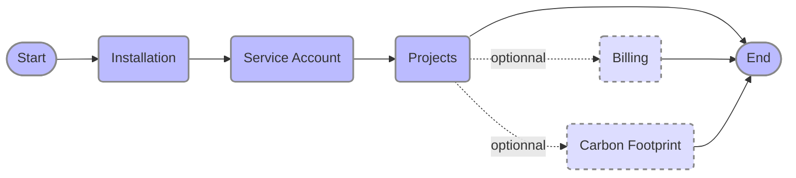

# Configuration Workflow

```mermaid
graph LR
    A([Start])
    B(Installation)
    C(Service Account)
    D(Projects)
    E(Billing)
    F(Carbon Footprint)
    Z([End])

    A --> B

    B --> C
    C --> D

    D -. optionnal .-> E
    D -. optionnal .-> F

    D --> Z
    E --> Z
    F --> Z

    style A fill:#bbf,stroke:#888,stroke-width:2px
    style B fill:#bbf,stroke:#888,stroke-width:2px
    style C fill:#bbf,stroke:#888,stroke-width:2px
    style D fill:#bbf,stroke:#888,stroke-width:2px
    style E fill:#ddf,stroke:#888,stroke-width:2px,stroke-dasharray: 5 5
    style F fill:#ddf,stroke:#888,stroke-width:2px,stroke-dasharray: 5 5
    style Z fill:#bbf,stroke:#888,stroke-width:2px

    click B "/installation/getting_started/" "Installation step" _blank
```
