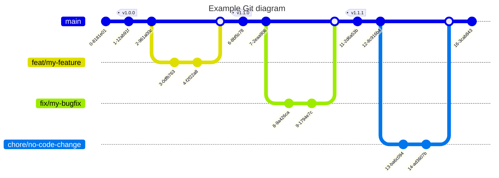

# Development Guidelines

## Commit convention

Every commit message should follow the [Conventional Commits](https://www.conventionalcommits.org/) specification.

## Branch strategy

Branch strategy is based on the simplest Git workflow:

* `main` branch is the main branch of the project
* `feature` branches are used to develop new features
* `fix` branches are used to fix bugs
* `chore` branches are used to perform maintenance tasks

Git branch strategy graph:



## Pull Requests

### Minimalist template

```markdown
## Describe your changes

## Related issue

## Checklist before requesting a review

- [ ] I have performed a self-review of my code
- [ ] If it is a core feature, I have added thorough tests.
- [ ] Do we need to implement analytics?
- [ ] Will this be part of a product update? If yes, please write one phrase about this update.
```

### Extended template

```markdown
## What type of PR is this?

## Description of the changes

## Related Tickets & Documents

## Tests

## Documentation

## Post-deployment tasks

## Checklist before requesting a review

- [ ] I have performed a self-review of my code
- [ ] If it is a core feature, I have added thorough tests.
- [ ] Do we need to implement analytics?
- [ ] Will this be part of a product update? If yes, please write one phrase about this update.
```
